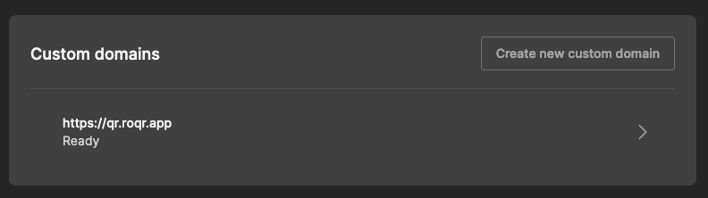

## Custom Domains

We're excited to announce the release of 'Custom Domains' – a new feature that allows users to add a custom domain to their organization and use it as a base for their QR codes.

When you create a dynamic QR code on our platform, traditionally the codes have encoded a link in the format `https://roqr.app/links/:id/scan`. This sends any scanner of your codes to our servers, which record some metadata related to the scan and then redirect the scanner to your configured target. However, some scanners will surface this link to the scanner, which can lead to confusion if they did not expect to see a link to the `roqr.app` domain.

A custom domain lets you change the link in your QR code to instead be tied to a domain you own. For example, if you own the `https://example.com` domain, you could choose to add the `https://qr.example.com` to RoQR, which would let you encode your links using the `https://qr.example.com/links/:id/scan` format. 

To add a custom domain, navigate to [organization settings](https://roqr.app/settings/organization) and follow these steps:

1. Submit a new domain. For example, if you own the `https://example.com` domain, you might use the `https://qr.example.com` subdomain for your QR codes.
2. RoQR will issue 3 DNS records that you will need to configure with your DNS provider to prove that you own the domain, and to redirect the domain to RoQR. Add the provided records with your DNS provider. This process varies depending on which DNS provider you use.
3. Once you have added the DNS records to your DNS provider, click the `Check again` button in your custom domain settings. RoQR will check that the DNS records are correctly configured and update the status of your custom domain. Once the DNS records have been verified, you are ready to use the custom domain when creating new links.

Currently, it's not possible to add a custom domain to an existing link. This is because the custom domain will change the link format, meaning that the QR code will change and have to be reprinted. To use a custom domain, instead create a new link from the links page.
