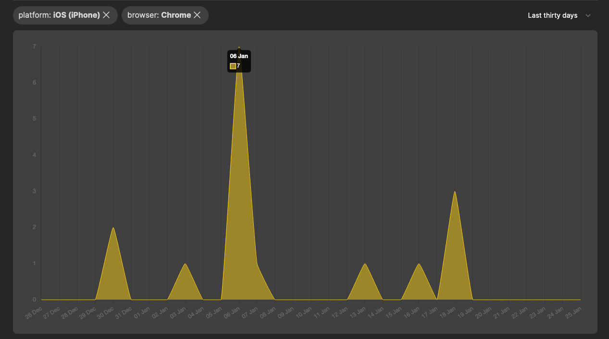

+++
title = "New feature: Insights filters"
description = "Cut through the noise by filtering the Insights page"
date = 2023-01-24
updated = 2023-01-24
draft = false
template = "blog/page.html"

[taxonomies]
authors = ["Sebastian Rollén"]

[extra]
lead = ""
+++

You can now filter the "Insights" page by link name, platform name, browser name, country and time-period.

To change the time-period filter, select a value from the top-right dropdown list.

To add any other filter, click on the attribute you want to filter by from the barcharts below.
